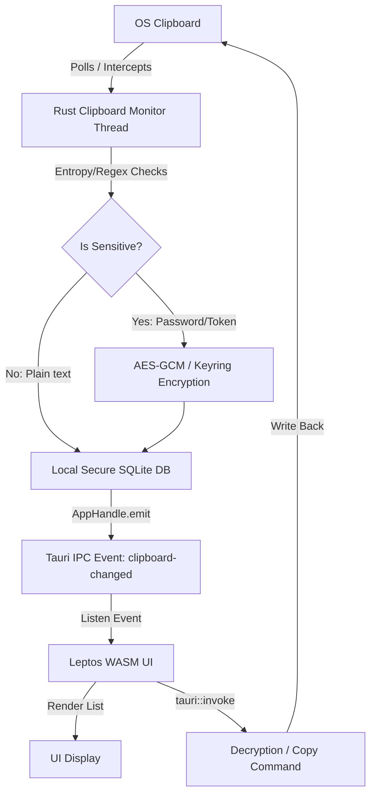

# RustyBoard - Secure Clipboard Manager Architecture

RustyBoard is a high-performance, 100% Rust-based secure clipboard manager. It leverages **Tauri 2** for OS integrations (System Tray, Hotkeys, Clipboard access) and **Leptos v0.7** (Client-Side Rendered WebAssembly) for a ultra-lightweight, reactive user interface.

## Conceptual Overview & Data Flow



---

## 1. Backend Architecture (Tauri 2 in Rust)

The backend runs a dedicated OS thread managed by Tauri's lifecycle. It is responsible for:
1. **Clipboard Monitoring:** Continuously watching the OS clipboard for new entries.
2. **Security Evaluation:** Checking if a copied string is a password, private key, or API token.
3. **Tray & Window Management:** Positioning the Leptos popup window near the system tray and listening to global hotkeys.

### Core Backend Setup: `src-tauri/src/lib.rs`

Here is the recommended blueprint for setting up the background thread and event dispatching in Tauri 2:

```rust
use std::thread;
use std::time::Duration;
use tauri::{AppHandle, Emitter, Manager};
use serde::{Serialize, Deserialize};

#[derive(Clone, Serialize, Deserialize)]
struct ClipboardItem {
    id: String,
    content: String,
    is_sensitive: bool,
    timestamp: u64,
}

// 1. Thread-safe command to copy an item back to the clipboard
#[tauri::command]
fn copy_to_clipboard(app: AppHandle, content: String) -> Result<(), String> {
    // Write content back securely
    // In Tauri 2, you can use the clipboard plugin or write native bindings
    Ok(())
}

// 2. Thread-safe command to fetch history (from DB)
#[tauri::command]
fn get_history() -> Vec<ClipboardItem> {
    // In production, fetch decrypted/evaluated items from a local SQLite/Keyring
    vec![]
}

// 3. Background thread to monitor OS clipboard
fn start_clipboard_monitor(app_handle: AppHandle) {
    thread::spawn(move || {
        let mut last_clipboard_contents = String::new();
        
        // In a real setup, we use the `arboard` crate or Tauri clipboard plugin
        loop {
            thread::sleep(Duration::from_millis(500));
            
            // Simulating clipboard check
            let current_contents = "some copied text".to_string(); 
            
            if current_contents != last_clipboard_contents && !current_contents.is_empty() {
                last_clipboard_contents = current_contents.clone();
                
                // Perform Security Entropy Analysis
                let is_sensitive = analyze_sensitivity(&current_contents);
                
                let item = ClipboardItem {
                    id: uuid::Uuid::new_v4().to_string(),
                    content: if is_sensitive { "•••••••• (Secure Data)".to_string() } else { current_contents.clone() },
                    is_sensitive,
                    timestamp: std::time::SystemTime::now()
                        .duration_since(std::time::UNIX_EPOCH)
                        .unwrap()
                        .as_secs(),
                };
                
                // Emit event to Leptos Frontend
                let _ = app_handle.emit("clipboard-changed", item);
            }
        }
    });
}

fn analyze_sensitivity(text: &str) -> bool {
    // Simple heuristic: High entropy or specific patterns (API keys, passwords)
    let has_numbers = text.chars().any(|c| c.is_numeric());
    let has_specials = text.chars().any(|c| !c.is_alphanumeric());
    text.len() > 8 && has_numbers && has_specials
}

#[cfg_attr(mobile, tauri::mobile_entry_point)]
pub fn run() {
    tauri::Builder::default()
        .plugin(tauri_plugin_opener::init())
        .setup(|app| {
            let handle = app.handle().clone();
            
            // Start the clipboard background monitor thread
            start_clipboard_monitor(handle);
            
            Ok(())
        })
        .invoke_handler(tauri::generate_handler![copy_to_clipboard, get_history])
        .run(tauri::generate_context!())
        .expect("error while running tauri application");
}
```

---

## 2. Frontend Architecture (Leptos v0.7 in WASM)

The frontend is a lightweight, reactive Client-Side Rendered (CSR) app written in Rust. It utilizes Leptos signals to update the UI instantly whenever the backend emits a `"clipboard-changed"` event.

### Reactive UI Component: `src/app.rs`

This Leptos component binds directly to Tauri's IPC, listens to the event bus, and renders a list with zero JavaScript overhead:

```rust
use leptos::prelude::*;
use serde::{Deserialize, Serialize};
use wasm_bindgen::prelude::*;

#[derive(Clone, Serialize, Deserialize)]
struct ClipboardItem {
    id: String,
    content: String,
    is_sensitive: bool,
    timestamp: u64,
}

// Bind to Tauri IPC via wasm-bindgen
#[wasm_bindgen]
extern "C" {
    #[wasm_bindgen(js_namespace = ["__TAURI__", "core"])]
    async fn invoke(cmd: &str, args: JsValue) -> JsValue;
}

#[component]
pub fn App() -> impl IntoView {
    // Reactive signal to store our clipboard history list
    let (history, set_history) = signal(Vec::<ClipboardItem>::new());

    // 1. Hook up the Tauri event listener on component mount
    Effect::new(move |_| {
        // Here we would bind to Tauri's event system:
        // window.__TAURI__.event.listen("clipboard-changed", ...)
        // When triggered, prepend the item to `set_history.update(|h| h.insert(0, item))`
    });

    // 2. Action to copy an item back to clipboard
    let copy_item = Action::new(|content: &String| {
        let content = content.clone();
        async move {
            let args = serde_wasm_bindgen::to_value(&serde_json::json!({ "content": content })).unwrap();
            invoke("copy_to_clipboard", args).await;
        }
    });

    view! {
        <main class="container">
            <header class="header">
                <h1>"RustyBoard"</h1>
                <span class="shield">"🛡️ Secure Mode Active"</span>
            </header>

            <div class="history-list">
                <For
                    each=move || history.get()
                    key=|item| item.id.clone()
                    children=move |item| {
                        let content_copy = item.content.clone();
                        view! {
                            <div class=move || if item.is_sensitive { "item sensitive" } else { "item" }>
                                <div class="item-body">
                                    <p class="content">{item.content.clone()}</p>
                                    <span class="time">"Just now"</span>
                                </div>
                                <button 
                                    class="copy-btn"
                                    on:click=move |_| { copy_item.dispatch(content_copy.clone()); }
                                >
                                    "📋 Copy"
                                </button>
                            </div>
                        }
                    }
                />
            </div>
        </main>
    }
}
```

---

## 3. High-Security Integration (Zero Trust Strategy)

To make `RustyBoard` truly **secure**:
1. **Memory Cleansing:** Decrypted clipboard strings should be stored inside zeroizing memory wrappers (like the `zeroize` crate) so they are wiped from RAM as soon as they go out of scope.
2. **Keyring Storage:** Instead of keeping plain-text database passwords, the SQLite master key is retrieved dynamically from the OS secure keystore using the `keyring` crate.
3. **No Clipboard Polling Overlap:** Ensure that when RustyBoard copies an item back to the OS clipboard, the background monitor thread **temporarily ignores** that specific copy event to avoid circular loop backups.
